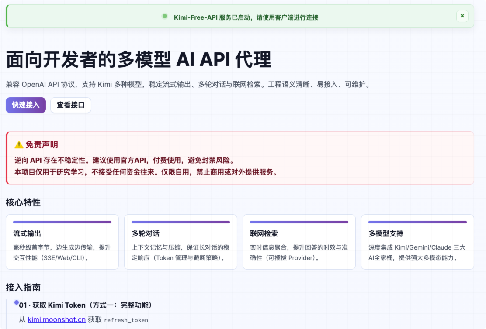
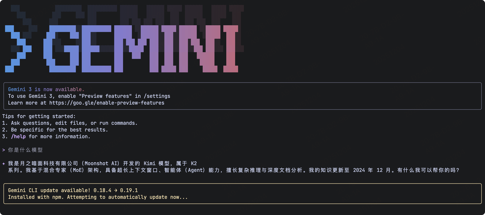
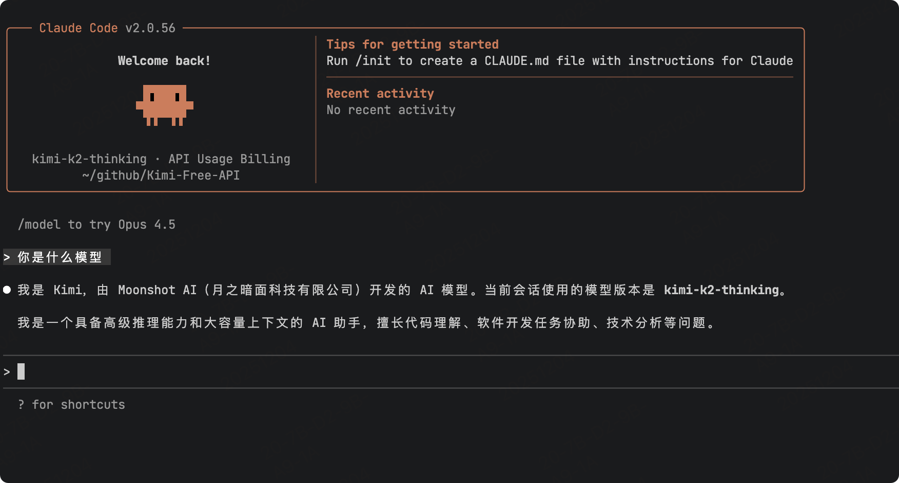

# KIMI AI Free Service

## Project Description

<span>[ <a href="README.md">中文</a> | English ]</span>

Supports high-speed streaming output, multi-turn conversations, internet search, agent conversations, exploration version, K2 thinking model, long document analysis, image parsing, zero-configuration deployment, multi-token support, and automatic session cleanup.

This project is modified from [https://github.com/LLM-Red-Team/kimi-free-api](https://github.com/LLM-Red-Team/kimi-free-api), thanks to the contributor!
> Important Note: The original project contains malicious code due to supply chain attacks. It is strongly recommended not to continue using it.

Reasons for modification:
1. The original project author account was banned and can no longer be updated
2. The malicious code in the original project has been removed. Welcome to review this project's source code

## Update Notes

1. Updated models.ts model list to support latest models like kimi-k2-0905-preview, kimi-k2-thinking, kimi-latest, etc.

2. **Added Connect RPC API support** with automatic Token type-based API selection
   - Support for new Connect RPC protocol (using kimi-auth Cookie)
   - Maintain traditional API compatibility (using refresh_token)
   - Automatic Token type detection and API routing

3. Repackaged new version of Docker image: `akashrajpuroh1t/kimi-free-api-fix:latest`

4. Fixed malicious code issues in source code and repackaged. The original project contained obfuscated code at the end of `src/api/chat.js` file

> PS: Model names don't actually matter much, just for convenience and aesthetics. Whatever model is used online in Chat calls is the actual model used. You can fill in any model name.

### Version Notes

- v1.0.2 (2025-12-04)
    - Modified default homepage style, added access methods and example code
    - Added Gemini and Claude adapters

- v1.0.1 (2025-11-28)
    - Added Connect RPC API support (TypeScript implementation)
    - Implemented automatic Token type detection and API routing
    - Added dual API support: Traditional API (full features) + Connect RPC (basic conversation)
    - Updated README access instructions to distinguish between two API methods
    - Optimized code structure, added `src/lib/connect-rpc/` module

- v1.0.0-fix (2025-11-25)
    - Modified default homepage style, added access methods and example code
    - Removed malicious code contained in the original project

## Disclaimer

**Reversed APIs are unstable. It is recommended to use the paid API from MoonshotAI official https://platform.moonshot.cn/ to avoid the risk of being banned.**

**This organization and individuals do not accept any fund donations or transactions. This project is purely for research, communication, and learning purposes!**

**For personal use only, prohibited from providing services to others or commercial use, to avoid pressure on official services. Otherwise, risks are borne by oneself!**

**For personal use only, prohibited from providing services to others or commercial use, to avoid pressure on official services. Otherwise, risks are borne by oneself!**

**For personal use only, prohibited from providing services to others or commercial use, to avoid pressure on official services. Otherwise, risks are borne by oneself!**

## Effect Examples

### Service Default Homepage

After starting the service, the default homepage adds access guides and interface documentation for easy quick integration, no need to switch back and forth to find documentation.



### Gemini-cli Access

The version added gemini-cli adapter, which can directly call API in gemini-cli.



### Claude-code Access

The version added claude-code adapter, which can directly call API in claude-code.



### Identity Verification Demo


### Multi-turn Conversation Demo


### Internet Search Demo


### Agent Conversation Demo

This uses the [Translation Agent](https://kimi.moonshot.cn/chat/coo6l3pkqq4ri39f36bg) agent.


### Long Document Analysis Demo


### Image OCR Demo


### Consistent Response Fluency


## Access Preparation

### Method 1: Traditional API (Full Features)

Get `refresh_token` from [kimi.moonshot.cn](https://kimi.moonshot.cn)

Start any conversation on Kimi, then open developer tools with F12, find the value of `refresh_token` in Application > Local Storage. This will be used as the Bearer Token value for Authorization: `Authorization: Bearer TOKEN`


If you see that `refresh_token` is an array, please use `.` to concatenate it before using.


**Supported Features:**
- ✅ Basic conversation
- ✅ Multi-turn conversation (conversation_id)
- ✅ Internet search
- ✅ Deep research
- ✅ File upload
- ✅ Image parsing
- ✅ Agent conversation
- ✅ Exploration version
- ✅ K1/K2 models

### Method 2: Connect RPC API (New, Basic Conversation Only)

Get `kimi-auth` Cookie from [kimi.moonshot.cn](https://kimi.moonshot.cn)

1. Visit https://kimi.moonshot.cn and login
2. Open developer tools with F12
3. Go to Application > Cookies > https://www.kimi.com
4. Find `kimi-auth` Cookie
5. Copy the complete JWT token value (starts with `eyJ`)

This will be used as the Bearer Token value for Authorization: `Authorization: Bearer JWT_TOKEN`

**Supported Features:**
- ✅ Basic conversation
- ✅ Streaming response
- ✅ Different scenarios (K2, Search, Research)
- ❌ **Not Supported**: Multi-turn conversation, file upload, image parsing, agent conversation

**Comparison:**

| Feature | Traditional API (refresh_token) | Connect RPC (kimi-auth) |
|---------|--------------------------------|------------------------|
| Token Location | LocalStorage | Cookie |
| Token Format | JWT (typ: refresh) | JWT (typ: access) |
| Basic Chat | ✅ | ✅ |
| Multi-turn | ✅ | ❌ |
| File Upload | ✅ | ❌ |
| Image Parsing | ✅ | ❌ |
| Agent | ✅ | ❌ |
| Stability | Stable | Latest API |

**Auto Selection:**

The service automatically selects the appropriate API based on token type:
- JWT Token (typ: access) → Uses Connect RPC API
- Refresh Token (typ: refresh) → Uses Traditional API

**Recommendation:**
- For full features, use **Traditional API** (refresh_token)
- For basic conversation only, use **Connect RPC** (kimi-auth)

### Multi-account Access

Currently, Kimi limits ordinary accounts to only 30 rounds of long text Q&A every 3 hours (short text is unlimited). You can provide multiple account refresh_tokens separated by commas:

`Authorization: Bearer TOKEN1,TOKEN2,TOKEN3`

The service will select one from them for each request.

## Docker Deployment

Please prepare a device or server that can deploy Docker images and access the network, and open port 8000.

Pull the image and start the service

```shell
docker run -it -d --init --name kimi-free-api -p 8000:8000 -e TZ=Asia/Shanghai akashrajpuroh1t/kimi-free-api-fix:latest
```

View service real-time logs

```shell
docker logs -f kimi-free-api
```

Restart service

```shell
docker restart kimi-free-api
```

Stop service

```shell
docker stop kimi-free-api
```

### Docker-compose Deployment

```yaml
version: '3'

services:
  kimi-free-api:
    container_name: kimi-free-api
    image: akashrajpuroh1t/kimi-free-api-fix:latest
    restart: always
    ports:
      - "8000:8000"
    environment:
      - TZ=Asia/Shanghai
```

## API List

Currently supports:

1. OpenAI-compatible `/v1/chat/completions` interface
2. Google Gemini-compatible `/v1beta/models/:model:generateContent` interface
3. Anthropic Claude-compatible `/v1/messages` interface

You can use OpenAI, gemini-cli, claude-code or other compatible client interfaces, or use online services like [dify](https://dify.ai/) for access.

### Chat Completions

Chat completions API, compatible with OpenAI's [chat-completions-api](https://platform.openai.com/docs/guides/text-generation/chat-completions-api).

**POST /v1/chat/completions**

Headers need to set Authorization:

```
Authorization: Bearer [refresh_token]
```

Request data:
```json
{
    // Model name
    // kimi: default model
    // kimi-search: internet search model
    // kimi-research: exploration version model
    // kimi-k1: K1 model
    // kimi-math: math model
    // kimi-silent: no search process output model
    // search/research/k1/math/silent: can be freely combined
    // If using kimi+agent, please fill in the agent ID in model, which is the 20-character English+numbers ID at the end of the browser address bar
    "model": "kimi-k2",
    // Currently multi-turn conversations are implemented based on message merging, which may lead to degraded capabilities in some scenarios and is subject to single-round maximum token limits
    // If you want to get native multi-turn conversation experience, you can pass the id obtained from the first round of messages to continue context. Note that if using this, the first round must pass 'none', otherwise the second round will return empty response!
    // "conversation_id": "cnndivilnl96vah411dg",
    "messages": [
        {
            "role": "user",
            "content": "Test"
        }
    ],
    // Whether to enable internet search, default false
    "use_search": true,
    // Set to true if using SSE stream, default false
    "stream": false
}
```

Response data:
```json
{
    // If you want to get native multi-turn conversation experience, this id can be passed to the next round's conversation_id to continue context
    "id": "cnndivilnl96vah411dg",
    "model": "kimi",
    "object": "chat.completion",
    "choices": [
        {
            "index": 0,
            "message": {
                "role": "assistant",
                "content": "Hello! I'm Kimi, an AI assistant developed by Moonshot AI Technology Co., Ltd. I'm skilled in Chinese and English conversations, can help you get information, answer questions, and can also read and understand files and web page content you provide. If you have any questions or need help, feel free to tell me!"
            },
            "finish_reason": "stop"
        }
    ],
    "usage": {
        "prompt_tokens": 1,
        "completion_tokens": 1,
        "total_tokens": 2
    },
    "created": 1710152062
}
```